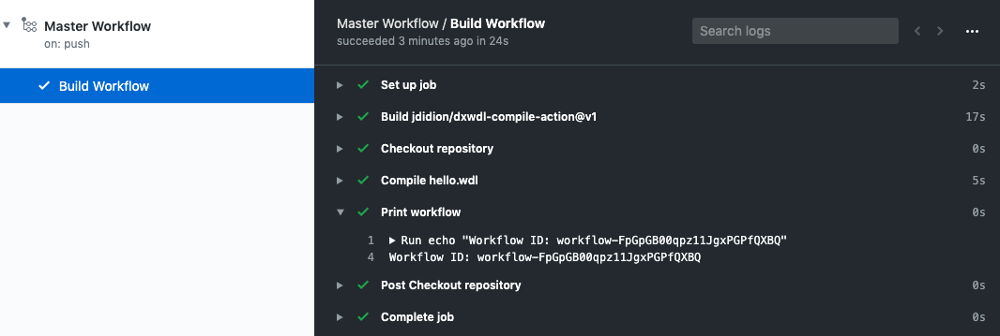

This [GitHub Action](https://help.github.com/en/actions) compiles a WDL workflow using [dxCompiler](https://github.com/dnanexus/dxCompiler).

## Usage

1. Create a GitHub repository containing your WDL workflow file in the root folder.
2. You may also have an [extras.json](https://github.com/dnanexus/dxCompiler/blob/master/doc/ExpertOptions.md#setting-dnanexus-specific-attributes-in-extrasjson) file in the root folder - it will be detected automatically.
3. Add a [secret](https://help.github.com/en/actions/configuring-and-managing-workflows/creating-and-storing-encrypted-secrets) in your repository with the name "API_TOKEN" and the value being a [DNAnexus API token](https://documentation.dnanexus.com/developer/api/authentication) that is configured with CONTRIBUTE access to the project in which you want to deploy your workflows/applets. You may use a different name for the secret, but you then need to change it in the workflow file as well.
4. Create a new workflow in .github/workflows (see the [example](#example)) and configure the action.

## Example

This is an excerpt from the [example project](example/).

```yaml
# .github/workflows/main.yaml
name: 'My Workflow'
on:
  push:
    branches:
      - 'master'
jobs:
  build:
    name: 'Build Workflow'
    runs-on: 'ubuntu-18.04'
    outputs:
      workflow_id: ${{ steps.compile.workflow_id }}
    steps:
      - name: 'Checkout repository'
        uses: 'actions/checkout@v2'
      - id: 'compile'
        name: 'Compile hello.wdl'
        uses: 'jdidion/dxcompiler-compile-action@v1'
        with:
          wdl: 'hello.wdl'
          # project-id is of the form 'project-XXX' and folder starts with '/'
          destination: '<project-id>:<folder>'
          api_token: '${{ secrets.API_TOKEN }}'
      - id: 'print'
        name: 'Print workflow'
        shell: 'bash'
        run: |
          echo "Workflow ID: ${{ steps.compile.outputs.workflow_id }}"
```

In this workflow, the compiled Workflow ID can be seen under the 'Print Workflow' Step in the output:



## Warnings

* This action always uses the latest version of dxCompiler. If you want to use a specific verison of dxCompiler to build your workflow, you'll need to clone this action and modify the [Dockerfile](Dockerfile) to specify a specific tag or digest in the `FROM` line, e.g.
    ```Dockerfile
    FROM dnanexus/dxcompiler@sha256:b475c64898626c681ac81496fe287d9f822f9d27eea448793dfe04f5eca77280
    ```
* If you are not an ADMIN of the project's billTo organization, dxCompiler will not be able to retrieve the instance pricing list it needs to optimize the choice of instance types. Your workflow will still compile, but it might be more expensive to run than it would if dxCompiler were able to obtain the price list.
